# Risky Business

In this assignment, several machine learning models were used to predict credit risk. Since, credit risk is an inherently imbalanced classification problem (the number of good loans is much larger than the number of at-risk loans), techniques for training and evaluating models with imbalanced classes were used. 

## Resampling

Scikit-learn and Imbalanced-learn libraries were used to build and evaluate the following models. The results of the models are as follows:

1. ### **Simple Logistic Regression**:

   **Balanced Accuracy Score**: 0.9520479254722232

   **Confusion Matrix**: 

   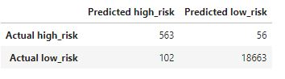

   **Imbalanced Classification Report**:

   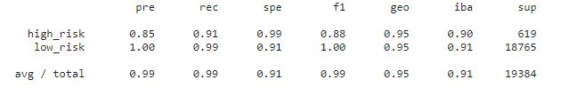

2. ### **Random Oversampling**:

   **Balanced Accuracy Score**: 0.9936781215845847

   **Confusion Matrix**: 

   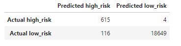

   **Imbalanced Classification Report**:

   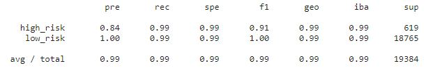

3. ### **SMOTE Oversampling**:

   **Balanced Accuracy Score**: 0.9936781215845847

   **Confusion Matrix**: 

   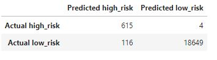

   **Imbalanced Classification Report**:

   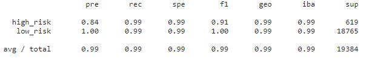

4. ### **Cluster Centroids Undersampling**:

   **Balanced Accuracy Score**: 0.9865149130022852

   **Confusion Matrix**: 

   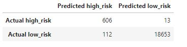

   **Imbalanced Classification Report**:

   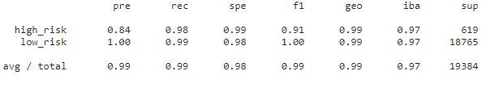

5. ### **SMOTEENN Combination Sampling**:

   **Balanced Accuracy Score**: 0.9935182494822666

   **Confusion Matrix**: 

   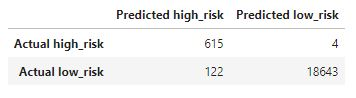

   **Imbalanced Classification Report**:

   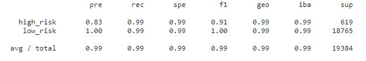

* Which model had the best balanced accuracy score?
  
  The balanced accuracy score for both the oversampling algorithms i.e. Random Oversampling and SMOTE Oversampling were the same and better than the other models.

* Which model had the best recall score?

  The recall scores for Random Oversampling, SMOTE Oversampling and SMOTEENN Combination Sampling were the same and better than the other models.

* Which model had the best geometric mean score?

  The geometric mean for oversampling, undersampling and combination sampling models were the same. However, the geometric mean values for simple logistic regression were different. 

## Ensemble Learning

Scikit-learn and Imbalanced-learn libraries were used to build and evaluate the following ensemble models. The results of the models are as follows:

1. ### **Balanced Random Forest Classifier**:

   **Balanced Accuracy Score**: 0.9927988250218349

   **Confusion Matrix**: 

   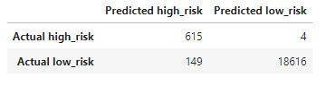

   **Imbalanced Classification Report**:

   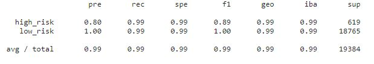

2. ### **Easy Ensemble Classifier**:

   **Balanced Accuracy Score**: 0.9931452145768576

   **Confusion Matrix**: 

   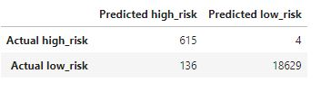

   **Imbalanced Classification Report**:

   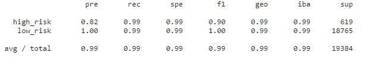   

* Which model had the best balanced accuracy score?
  
  The Easy Ensemble Classifier had the best balanced accuracy score.

* Which model had the best recall score?

  Recall scores for both models were identical.

* Which model had the best geometric mean score?

  The geometric mean for both models were the same. 

* What are the top three features?

  The top three Balanced Random Forest Classifier features and their scores were:

  - Borrower Income : 0.21788480603139448
  - Interest Rate : 0.19595880072166166
  - Debt to Income : 0.1770964986362893

